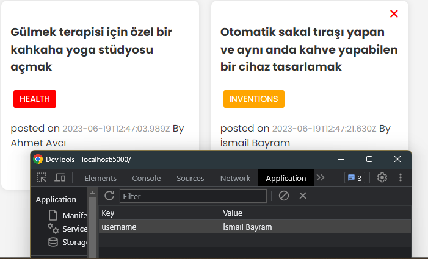

# Random Ideas App 
## This is a fullstack application for sharing random ideas. It is a project in my Modern JS From The Beginning course.

<br>

## This app includes a Node.js/Express REST API that uses MongoDB for a database. The client-side is built with Webpack.


<br>

# Home Page


# Form Page


# Delete System if your username is match then you can delete


# Database. You can update delete or put ıdeas with MongoDB 


# You can query with Postman


<br>


## Usage

### Install Dependencies

Install dependencies on the front-end and back-end

```bash
npm install
cd client
npm install
```

### Back-end/Express Server

```bash
npm start
```

or

```bash
npm run dev (Nodemon)
```

Visit `http://localhost:5000`

### Front-end/Webpack Dev Server

```bash
cd client
npm run dev
```

Visit `http://localhost:3000`

To build front-end production files

```bash
cd client
npm run build
```

The production build will be put into the `public` folder, which is the Express static folder.

### Environment Variables

Rename `.env-example` to `.env` and add your MongoDB URI to the `.env` file.

```
MONGO_URI=your_mongodb_uri
```

## REST Endpoints

### Ideas

| Endpoint       | Description    | Method | Body                    |
| -------------- | -------------- | ------ | ----------------------- |
| /api/ideas     | Get all ideas  | GET    | None                    |
| /api/ideas/:id | Get idea by id | GET    | None                    |
| /api/ideas     | Add idea       | POST   | { text, tag, username } |
| /api/ideas/:id | Update idea    | PUT    | { text, tag, username } |
| /api/ideas/:id | Delete idea    | DELETE | username                |

When updating or deleting, the username must match the username of the idea creator.


## Used Technologys
<br>

### HTML& CSS
### JavaScript
### MongoDB
### NextJs
### Webpack

